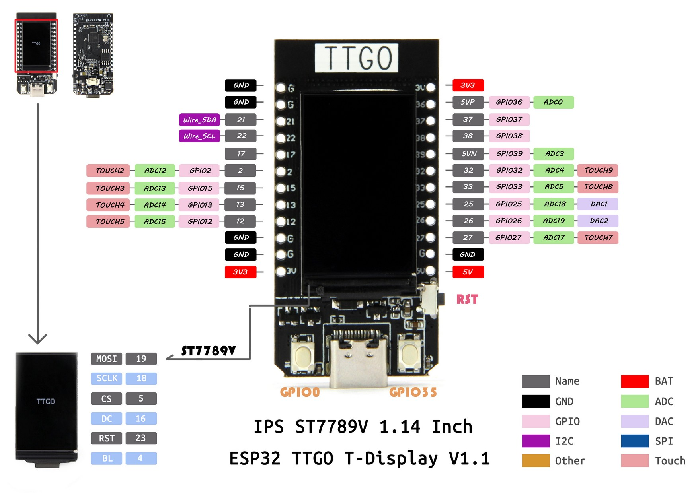

# ESP32_TTGO_FreeRTOS

* Testes de estudo com ESP32 + FreeRTOS *

## Configuração da placa no platformio.ini
https://docs.platformio.org/en/latest/boards/espressif32/lilygo-t-display.html

## Informação da placa:
https://www.smartkits.com.br/ttgo-t-display-v1-1-esp32-com-display-ips-1-14-colorido-16mb

## Display:
- Alterar arquivo 'User_Setup_Select.h' descomentar a linha: ''' #include <User_Setups/Setup25_TTGO_T_Display.h> ''' 
- Alterar a resolução, no arquivo ""User_Setup.h""
  '''
  #define ST7789_DRIVER  
  #define TFT_WIDTH  240 
  #define TFT_HEIGHT 240 
  '''
- 

## Informação do PlatformIO usando FreeRTOS:
https://docs.platformio.org/en/latest/tutorials/index.html

## Código original da placa
https://github.com/Xinyuan-LilyGO/TTGO-T-Display?spm=a2g0o.detail.1000023.2.5799BGU3BGU3y3

## Memória 16MB
Utilizar a seguinte informação no platformio.ini

 - board_upload.flash_size = 16MB
 - board_build.partitions = partitions.csv
  
  Adicionar o arquivo partitions.csv no mesmo diretório do platformio.ini com a sequinte informação:
'''  # Name,   Type, SubType, Offset,  Size, Flags
nvs,      data, nvs,     0x9000,  0x5000,
otadata,  data, ota,     0xe000,  0x2000,
app0,     app,  ota_0,   0x10000, 0x700000,
app1,     app,  ota_1,   0x710000,0x700000,
spiffs,   data, spiffs,  0xE10000,0x1F0000,
'''

## Realizando o OTA
